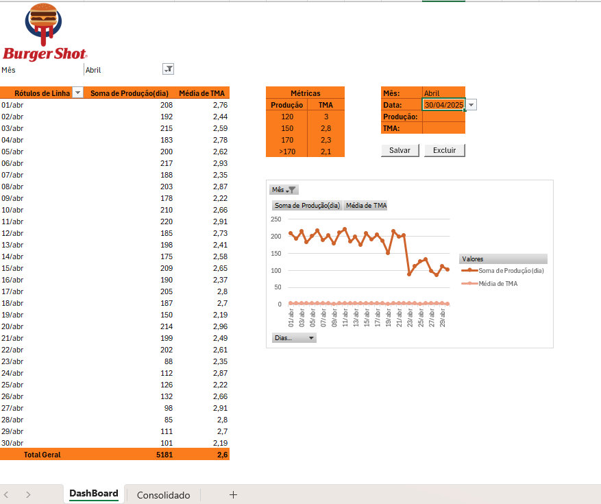

# 🍔 Dashboard de Produção - Abril | BurgerShot

Este projeto apresenta um painel de controle desenvolvido em Excel com VBA, voltado para a gestão da produção e tempo médio de atendimento (TMA) de uma operação fictícia — **BurgerShot**.

---

## 📌 Descrição

O sistema permite:

✅ Registro diário de produção e TMA via formulário  
✅ Atualização automática da Tabela Dinâmica  
✅ Visualização gráfica dos dados por mês  
✅ Interface amigável com botões de Salvar e Excluir  
✅ Métricas de performance baseadas na produção diária

---

## 📁 Arquivos

- `Dashboard-Produção-Abril.xlsm` → Planilha com o dashboard funcional e automações VBA  
- `README.md` → Documentação do projeto  
- `planilhabs.png` → Imagem do dashboard como apresentado acima

---

## 🧠 Funcionalidades VBA

- **Botão Salvar:**  
  Atualiza ou insere dados no consolidado com base no mês e dia informados.  

- **Botão Excluir:**  
  Zera os dados de Produção e TMA mantendo a estrutura de datas intacta.  

- **Atualização Automática:**  
  A Tabela Dinâmica é atualizada sempre que os dados são salvos ou excluídos.

---

## 📊 Visualização

- Filtros interativos por **mês**
- Gráfico com **soma da produção diária** e **média de TMA**
- Indicadores coloridos de desempenho para análise rápida

---

## 👨‍💼 Autor

**Rafael Luis Martins**  
🔗 [LinkedIn](https://www.linkedin.com/in/rafael-luis-martins-096034a3/)

---

## 🚀 Como usar

1. Baixe o arquivo `.xlsm`
2. Habilite as macros no Excel
3. Use o formulário na aba `DashBoard` para lançar dados
4. Acompanhe os indicadores no gráfico dinâmico

---

## 💬 Observação

Este projeto foi criado para portfólio e prática de automações com **Excel VBA**, **Tabelas Dinâmicas** e **Dashboards de Produção**.

---

